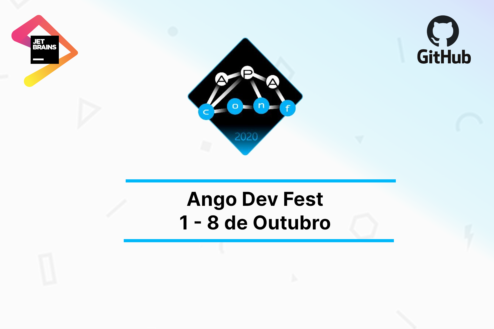

# Ango-Dev-Fest 2020

Este evento anual tem como objectivo incentivar programadores de Angola
a contribuirem mais em projectos abertos no Github criado por Angolanos.



Quem pode participar?
--------------------
Qualquer Angolano com conta no Github.


Como participar?
----------------

```elixir
1 => "Faça uma PR em qualquer repositório que pertence a um Angolano (Que não seja você)."
2 => "A PR pode incluir melhorias de documentação, adição de testes, novas funcionalidades e refactorização de código."
3 => "Deixe o link da PR no post que fala sobre este evento (LinkedIn, Facebook, Twitter) ou crie uma issue neste repositório
com o link da sua PR."
```

Quais são os critérios para ganhar?
-----------------------------------
```elixir
1 => "Qualidade dos commits."
2 => "Deve obedecer o código de conduta do projecto."
3 => "Deve conter commits feitos apenas por ti."
4 => "PRs que realmente adicionam valor ao projecto, PRs que foram aceitados. (merged, testes devem passar)."
```

E o premio?
----------------
O vencedor irá ganhar um prémio patrocinado pela Jetbrains. 
Este prémio permitirá usar qualquer IDE da Jetbrains por um ano.

```elixir
ides = [:intellij_ultimate,
 :go_land,
 :web_storm,
 :ruby_mine,
 :py_charm,
 :clion,
 :app_code,
 :rider,
 :php_storm]

Enum.map(ides, fn ide -> ganha_premio(x) end) |> voce!
```


Quando o vencedor será anunciado?
---------------------------------
9 de Outubro de 2020

------------------------------------------------------------